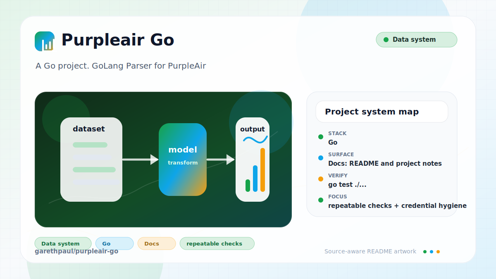

# purpleair-go

<!-- README-OVERVIEW-IMAGE -->


## Overview

`garethpaul/purpleair-go` is a Go project. GoLang Parser for PurpleAir

This README is based on the checked-in source, manifests, scripts, and repository metadata on the `master` branch. The project language mix found during review was: Go (5).

## Repository Contents

- `README.md` - project overview and local usage notes
- `CHANGES.md` - notable maintenance changes
- `Makefile` - local verification entry points
- `.github/workflows/check.yml` - hosted current-Go verification matrix
- `go.mod`
- `go.sum`
- `docs/plans` - canonical completed maintenance plans
- `plans` - completed maintenance plans
- `scripts/check-baseline.sh` - repository maintenance baseline guard
- `SECURITY.md` - security reporting and disclosure guidance
- `VISION.md` - project direction and maintenance guardrails

Additional scan context:

- Source directories: no top-level source directories detected
- Dependency and build manifests: go.mod, go.sum, Makefile
- Entry points or build surfaces: Makefile
- Test-looking files: client_test.go, sensor_test.go

## Getting Started

### Prerequisites

- Git
- Go

### Setup

```bash
git clone https://github.com/garethpaul/purpleair-go.git
cd purpleair-go
go mod download
```

The setup commands above are derived from repository files. Legacy mobile, Python, or JavaScript samples may require older SDKs or package versions than a modern workstation uses by default.

## Running or Using the Project

- Import `github.com/garethpaul/purpleair-go` from Go code and construct a client with `NewClient()`.
- Use `NewClientWithBaseURL(baseURL)` when a local proxy, fixture server, or
  alternate PurpleAir-compatible endpoint is needed.
- Use `SensorWithError(sensorID)` for error-returning calls, or the compatibility `Sensor(sensorID)` wrapper for the original behavior.
- Use `SensorWithContext(ctx, sensorID)` when callers need cancellation or a
  deadline shorter than the client's HTTP timeout.
- `SensorWithError(sensorID)` returns errors for blank sensor IDs, request
  failures, nil HTTP responses, empty response bodies, non-2xx responses,
  oversized response bodies, malformed JSON, and successful responses that
  contain no sensor results or results with non-positive sensor IDs.
- `NewClient()` and zero-value clients use a five-minute HTTP timeout by default.
- Blank custom base URLs fall back to the default PurpleAir JSON endpoint, and
  existing query parameters are preserved when the `show` sensor ID is added.
- Custom base URLs must be absolute `http` or `https` URLs with a host; invalid
  values fall back to the default PurpleAir JSON endpoint.
- Custom base URLs must not embed username/password credentials; use local
  configuration or request headers outside the checked-in URL instead.
- Custom base URLs must not include URL fragments; keep local-only tokens or
  notes out of endpoint strings.
- `SensorWithError` wraps transport failures with PurpleAir-specific request
  context while preserving the original Go error.
- `SensorWithContext` propagates the caller context to the HTTP request and
  preserves cancellation and deadline errors through that wrapper.

## Testing and Verification

- `go test ./...`
- `go test -race ./...`
- `make lint`
- `make race`
- `make vet`
- `make test`
- `make build`
- `make check`
- `make verify`
- `scripts/check-baseline.sh`

`make vet` runs `go vet ./...`, and `make race` runs `go test -race ./...`.
`make check` delegates to `make verify`, which checks Go formatting, vet, unit
and race tests, the Go build-through-test gate, and completed plans under
`docs/plans`.
Tests and executable examples use mocked HTTP servers and do not call the live
PurpleAir endpoint, including response validation edge cases.
GitHub Actions runs the same gate on Go 1.25.11 and Go 1.26.4 with read-only
permissions and pinned actions.

The baseline script checks required files, module metadata, completed docs-plan
metadata, verification documentation, and local secret/editor metadata hygiene.

When the required SDK or runtime is unavailable, use static checks and source review first, then verify on a machine that has the matching platform toolchain.

## Configuration and Secrets

- Detected references to PurpleAir. Keep API keys, OAuth credentials, tokens, and account-specific values in local configuration only.

## Security and Privacy Notes

- Review changes touching external API calls or credential-adjacent configuration; examples from the scan include client.go, client_test.go, go.mod, results.go, and 2 more.
- Review changes touching network requests, sockets, or service endpoints; examples from the scan include client.go, client_test.go, sensor.go.
- Review changes touching file, media, JSON, XML, CSV, OCR, or data parsing; examples from the scan include client.go, client_test.go, results.go, sensor.go.
- `NewClientWithBaseURL` rejects URLs with embedded userinfo credentials so
  endpoint configuration does not hide secrets in the base URL.
- `NewClientWithBaseURL` rejects URL fragments so local-only tokens or notes
  do not hide in endpoint configuration.

## Maintenance Notes

- See `SECURITY.md` for vulnerability reporting and safe research guidance.
- See `VISION.md` for project direction and contribution guardrails.
- See `docs/plans/2026-06-08-purpleair-go-baseline.md` for the canonical
  deterministic client-test baseline.
- See `docs/plans/2026-06-08-client-input-and-timeout-guards.md` for the
  sensor ID and timeout guard baseline.
- See `docs/plans/2026-06-08-sensor-with-error-examples.md` for the executable
  `SensorWithError` examples baseline.
- See `docs/plans/2026-06-09-custom-base-url-client.md` for the custom endpoint
  constructor guard.
- See `docs/plans/2026-06-09-custom-base-url-validation.md` for the custom
  endpoint URL validation guard.
- See `docs/plans/2026-06-09-custom-base-url-credentials-guard.md` for the
  custom endpoint credential guard.
- See `docs/plans/2026-06-09-custom-base-url-fragment-guard.md` for the custom
  endpoint fragment guard.
- See `docs/plans/2026-06-09-empty-response-body-guard.md` for the
  `SensorWithError` empty-body error guard.
- See `docs/plans/2026-06-09-request-failure-context.md` for request-failure
  context, nil-response handling, and repository gate aliases.
- See `docs/plans/2026-06-09-response-body-size-guard.md` for the
  `SensorWithError` response body size guard.
- See `docs/plans/2026-06-09-scripted-baseline-check.md` for the scripted
  repository baseline guard and local metadata checks.
- See `docs/plans/2026-06-10-go-vet-verification-gate.md` for the static
  analysis verification gate.
- See `docs/plans/2026-06-10-hosted-go-validation.md` for the current-Go matrix
  and canonical race detector gate.
- See `docs/plans/2026-06-10-sensor-context-cancellation.md` for caller-driven
  request cancellation and deadline support.

## Contributing

Keep changes small and tied to the project that is already present in this repository. For code changes, document the toolchain used, avoid committing generated dependency directories or local configuration, and update this README when setup or verification steps change.
